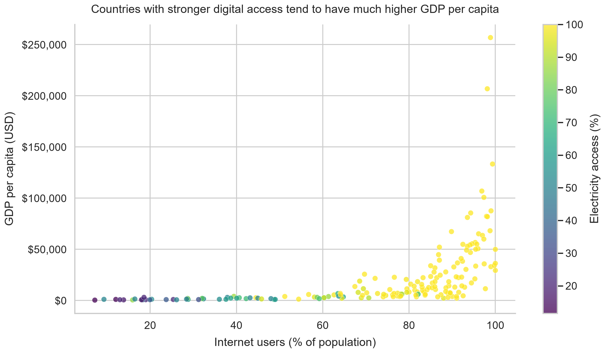

# What Really Predicts GDP per Capita?

When people talk about prosperity, they often jump straight to GDP per capita. The number is imperfect, but it is still a useful shortcut for a practical question: what kinds of public conditions keep showing up in richer countries?

To test that, I built a model from World Bank data covering 217 countries between 2015 and 2023. I compared GDP per capita against internet usage, electricity access, life expectancy, trade openness, unemployment, urbanization, education spending, and a few other public indicators.

## 1. Which indicators matter most?

The biggest signals were not exotic. Life expectancy, electricity access, and internet usage carried more predictive weight than almost anything else. In other words, countries tend to be richer when basic systems work and more people can reliably participate in modern economic life.

## 2. How different are low- and high-GDP country profiles?

The gap was not subtle. In the latest year of data, bottom-quartile countries had median internet usage near 32%, while top-quartile countries sat above 95%. Electricity access and life expectancy showed the same kind of spread. The difference is not just about money already earned. It is also about whether the underlying infrastructure exists for people to learn, work, and trade effectively.

## 3. How accurate is the model?

The model was useful on countries it had never seen before. Using grouped validation, the best model reached an out-of-sample `R^2` of about 0.71. That is strong enough to be informative, even if it is nowhere near perfect.

## 4. What happens in a creative predictive scenario?

I started with a real 2023 Sub-Saharan African country profile close to the regional median, then raised internet access, electricity access, life expectancy, trade openness, and education spending toward the middle-to-upper global band. The model's predicted GDP per capita rose from about $1.5K to roughly $10.9K.

That is not a promise, and it is definitely not proof of causation. But it is a clear signal. If you want to understand why some countries break upward and others stall, start with the basics: health, power, connectivity, and access.
